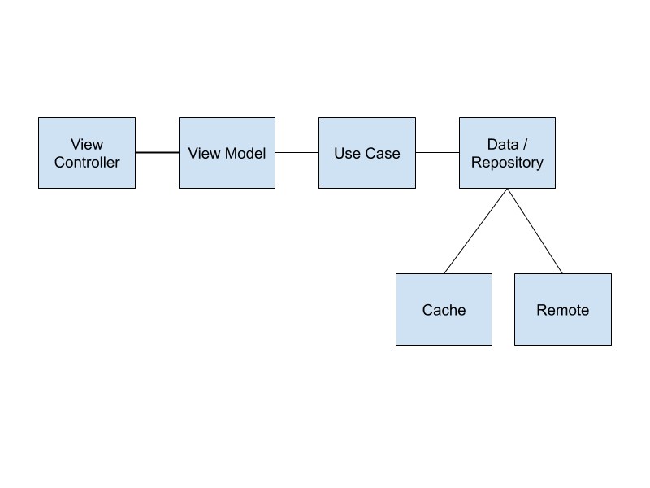
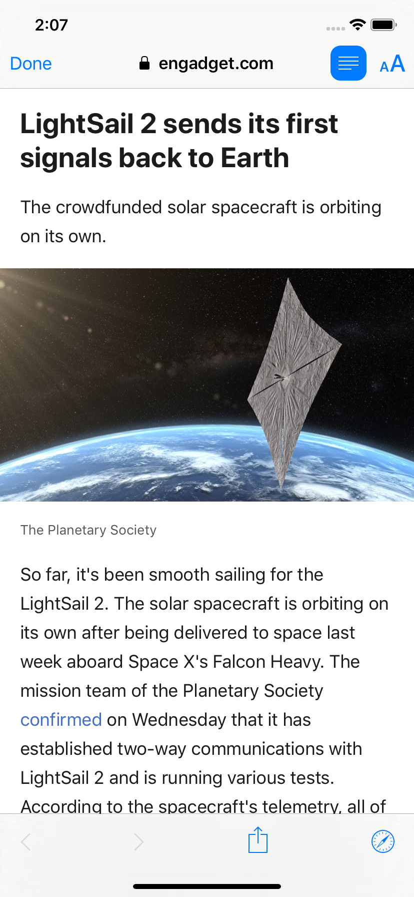

# iOS-NewsApp

Simple News app build using [https://newsapi.org](https://newsapi.org)

The app is based on MVVM architecture, principles of clean code and is split across multiple modules. 

The app uses iOS libraries such as,

* [RxSwift](https://github.com/ReactiveX/RxSwift) 
* [RxCocoa](https://github.com/ReactiveX/RxSwift/tree/master/RxCocoa)
* [Swinject](https://github.com/Swinject/Swinject) - Dependency injection framework for Swift with iOS/macOS/Linux
* [Cuckoo](https://github.com/Brightify/Cuckoo) - Boilerplate-free mocking framework for Swift!

## App Architecture

**Todo** - Cache module is not yet implemented.

## ScreenShots

 &nbsp; &nbsp; &nbsp; &nbsp; 
